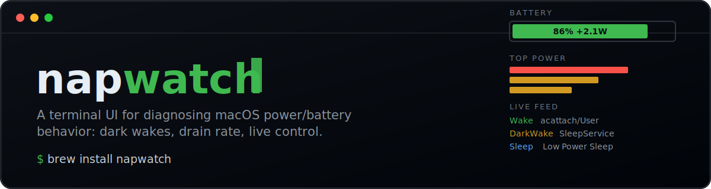
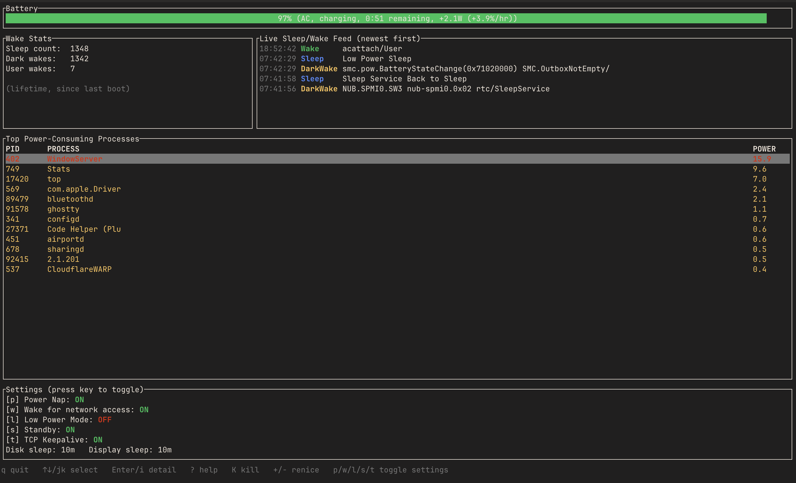
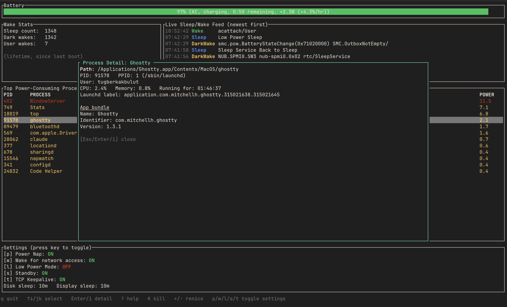
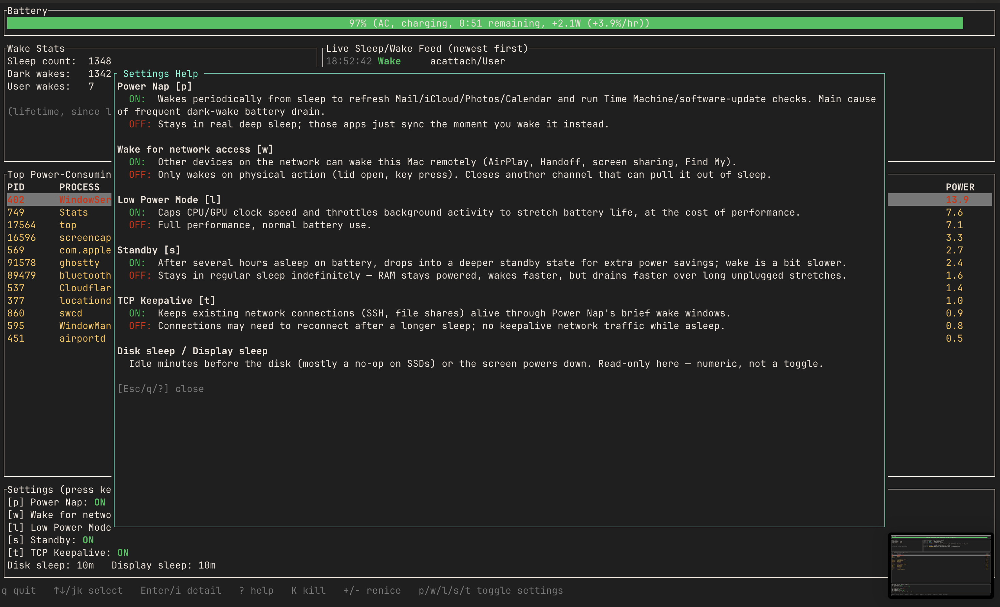

<p align="center">
  
</p>

<p align="center">
  <a href="LICENSE"></a>
  
  
  <a href="https://github.com/Tuguberk/homebrew-napwatch"></a>
  <a href="https://github.com/Tuguberk/napwatch/stargazers"></a>
  
</p>

<p align="center">
  Built after discovering a MacBook's battery was draining to zero overnight because of Power Nap–driven <b>"dark wakes"</b> — not a runaway app.
</p>

---

napwatch answers three questions live, in one screen:

- What's actually consuming power right now (processes, instant Watts)?
- Is the machine really sleeping, or quietly waking itself up every few minutes?
- Which of macOS's power settings are on, and can I flip them without leaving the terminal?

macOS only. Built in Rust with [ratatui](https://github.com/ratatui/ratatui) + [crossterm](https://github.com/crossterm-rs/crossterm).

## Screenshots

**Live dashboard** — battery gauge with instant Watts, wake-event feed, power-ranked process table, settings panel:

<p align="center">
  
</p>

<table>
<tr>
<td width="50%" valign="top">

**Process detail** (`Enter`/`i`) — full path, parent, launchd label, app bundle info:



</td>
<td width="50%" valign="top">

**Settings help** (`?`) — what each toggle does when on vs. off:



</td>
</tr>
</table>

## Table of contents

- [Features](#features)
- [Install](#install)
- [Usage](#usage)
- [Keybindings](#keybindings)
- [Debug flags](#debug-flags)
- [How it gets its data](#how-it-gets-its-data)
- [Project layout](#project-layout)
- [Background](#background)

## Features

### Battery
- Percentage, AC/battery state, charging status, macOS's own time-remaining estimate.
- **Instant power draw**: real Watts and %/hour, computed from `ioreg`'s `InstantAmperage`/`Voltage`/`AppleRawMaxCapacity` — no waiting period, correct from the very first poll. (An earlier version tried to derive a rate from whole-percentage deltas over a rolling window, which meant waiting 3 minutes for a trustworthy number; this replaced it.)

### Wake Stats + Live Sleep/Wake Feed
- Lifetime sleep / dark-wake / user-wake counts since last boot (`pmset -g stats`).
- A live-updating feed of new sleep/wake events as they happen, sourced from `pmset -g log`, color-coded by kind (Sleep / DarkWake / Wake) with a cleaned-up reason string. This is the direct payoff of the original investigation: toggle Power Nap off and watch `DarkWake` entries stop appearing.
- `pmset -g log` always dumps the *entire* history (there's no since/tail flag) and costs 1s+ once the log has days of entries, so it's polled on its own slower cadence (~16s) rather than every tick. On startup the feed seeds with the last 5 historical events rather than replaying the whole log.

### Top Power-Consuming Processes
- Ranked by energy-impact score from `top -o power`.
- `top -l 1` (a single sample) reads 0.0 for every process, because power is a rate that needs a delta between two samples — this app runs `top -l 2` and keeps only the second sample.
- **Navigate**: `↑`/`↓` or `j`/`k`. Selection tracks the process's PID rather than its row index, so it stays on the same process even as the table re-sorts every poll.
- **Detail view** (`Enter` or `i`): full executable path, PID/PPID + parent process name, user, CPU%/memory%, running time, launchd label if managed by launchd, and — if it's an app bundle — the display name/bundle identifier/version (read straight from `Info.plist` via `plutil`, which doesn't depend on Spotlight indexing the way `mdls` does).
- **Kill** (`K`): sends SIGTERM after a y/n confirmation prompt.
- **Renice** (`+`/`=` to lower priority, `-` to raise it): adjusts by ±1, clamped to the valid `-20..=19` range.

### Settings
Toggleable: Power Nap (`p`), Wake for network access (`w`), Low Power Mode (`l`), Standby (`s`), TCP Keepalive (`t`). Read-only: Disk sleep / Display sleep (numeric, not booleans).

Press `?` for an in-app explanation of what each one actually does when on vs. off.

### Everything else
- Status messages (toggle confirmations, errors) show in the footer and auto-clear after 4 seconds instead of sticking around forever.
- Sudo is requested once at startup (before the alternate screen opens, so the password prompt is a normal terminal prompt) and the ticket is refreshed every 60 seconds in the background — toggles, kill, and renice never need to re-prompt mid-session. If sudo isn't available, the app still runs in read-only mode: toggles are disabled, but kill/renice still work on your own processes (just not on processes owned by other users).

## Install

### Homebrew (recommended)

```sh
brew install Tuguberk/napwatch/napwatch
```

This one-liner taps the repo, trusts that specific formula, and installs — all in a single command, no separate `brew tap`/`brew trust` step needed. (Naming the tap and formula out explicitly like this is what Homebrew treats as sufficient intent to auto-trust it; running a bare `brew tap` followed by a bare `brew install napwatch` does *not* auto-trust, and will stop with an "untrusted tap" error asking you to run `brew trust` yourself. Both paths get you to the same place — this one just does it in one step.)

This builds from source on your machine (Homebrew pulls in `rust` as a build dependency automatically), so the first install takes a minute or two. Uninstalling `napwatch` later will also remove `rust` if nothing else on your system needs it — that's Homebrew correctly cleaning up a dependency that was only there to build this one formula, not a bug.

> **Heads up:** if your Homebrew hasn't auto-updated in a while, `brew install`/`brew tap` will trigger that update first, which can cascade into `brew autoremove` cleaning up formulae that were only installed as (now-orphaned) dependencies of other things. Run `brew update && brew autoremove --dry-run` on its own beforehand if you want to see what that would touch before it happens as a side effect of installing napwatch.

### From source

Requires Rust (`rustup` recommended: `curl --proto '=https' --tlsv1.2 -sSf https://sh.rustup.rs | sh`).

```sh
git clone https://github.com/Tuguberk/napwatch.git
cd napwatch
cargo install --path .
```

This installs the `napwatch` binary to `~/.cargo/bin` (make sure that's on your `PATH`).

## Usage

```sh
napwatch
```

On first launch it asks for your password once, to enable the settings toggles and cross-user kill/renice. Answer no / let it fail and the app still runs, just without those.

## Keybindings

| Key | Action |
|---|---|
| `q` / `Esc` | Quit (or close whatever popup is open) |
| `↑`/`↓`, `j`/`k` | Move selection in the process table |
| `Enter` / `i` | Show detail popup for the selected process |
| `K` | Kill selected process (asks for `y` to confirm) |
| `+` / `=` | Renice selected process down in priority (nice +1) |
| `-` | Renice selected process up in priority (nice -1) |
| `p` | Toggle Power Nap |
| `w` | Toggle Wake for network access (Wake-on-LAN) |
| `l` | Toggle Low Power Mode |
| `s` | Toggle Standby |
| `t` | Toggle TCP Keepalive |
| `?` | Toggle the settings help popup |

## Debug flags

These skip the TUI entirely and print raw data to stdout — handy for checking that a data source is parsing correctly:

```sh
napwatch --once             # one-shot dump of battery/wake/settings/top-processes
napwatch --detail <pid>     # full detail lookup for a single PID
napwatch --wake-log         # parse pmset -g log and print the last 10 events
```

## How it gets its data

Nothing here talks to a private API — it's all standard macOS command-line tools, shelled out to and parsed:

| Source | Used for |
|---|---|
| `pmset -g batt` | Battery percentage, charging state, time remaining |
| `pmset -g stats` | Lifetime sleep/dark-wake/user-wake counts |
| `pmset -g log` | Sleep/wake event history (for the live feed) |
| `pmset -g` / `pmset -a` | Reading and writing power settings (Power Nap, Wake-on-LAN, etc.) |
| `ioreg -rn AppleSmartBattery` | Instant amperage/voltage/capacity for the real-time Watts figure |
| `top -l 2 -o power` | Per-process energy-impact ranking |
| `ps` | Per-process detail (parent, user, CPU/mem, elapsed time, nice value) |
| `plutil -extract` | App bundle name/identifier/version from `Info.plist` |
| `launchctl list` | Mapping a PID to its launchd job label |
| `renice` / `kill` | Process priority changes and termination |

## Project layout

```
src/
├── main.rs     entry point, terminal setup/teardown, event loop, keybindings
├── app.rs      App state, background polling thread, status-message TTL
├── power.rs    all the shell-out + parsing logic for the data sources above
├── actions.rs  sudo handling, and the mutating actions (toggle/kill/renice)
└── ui.rs       ratatui rendering — gauges, tables, popups
```

## Background

This started as a one-off investigation into why a MacBook's battery was hitting 0% after sitting closed for a few days. `pmset -g stats` turned up the smoking gun: **1,342 dark wakes against only 6 real user wake-ups** over about a week — the machine was waking itself up roughly every 15 minutes, day and night, for Power Nap–driven mail/iCloud/Calendar sync and FileVault health checks, and that adds up to real drain across many idle days even though each individual wake only lasts a couple of seconds. napwatch grew out of turning that one-time `pmset`/`top`/`ioreg` investigation into a tool that watches for it continuously and lets you act on it without leaving the terminal.

---

<p align="center">
  <sub>MIT licensed — see <a href="LICENSE">LICENSE</a>.</sub>
</p>
